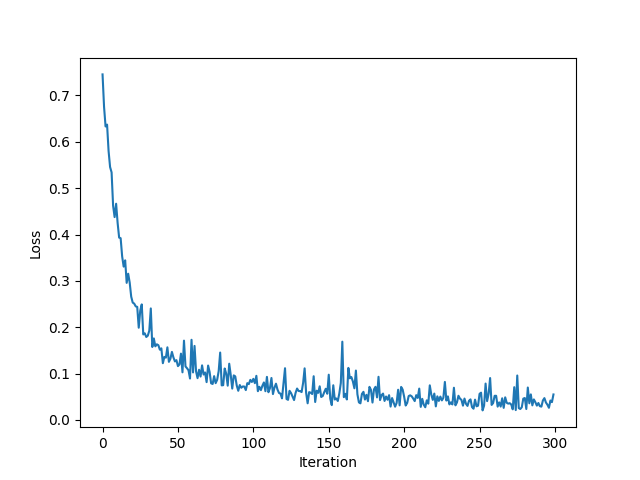
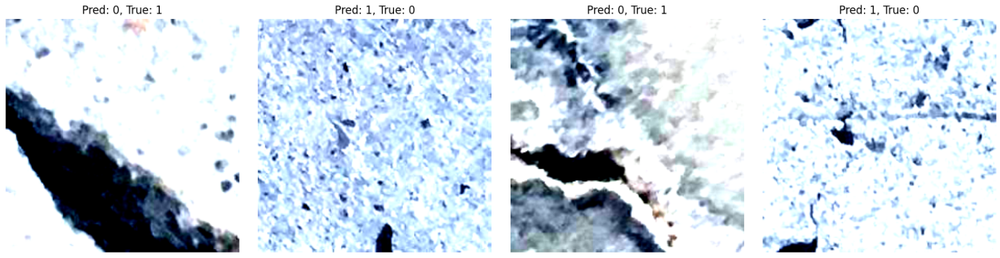

# Automated Image Defect Detection with ResNet18


_Created by **Réka Gábosi**_

## Table of Contents

- [Description](#description)
- [Project Structure](#project-structure)
- [How the Model Works](#how-the-model-works)
- [Results](#results)
- [Setup & Usage](#setup--usage)
- [Future Work](#future-work)
- [License](#license)
- [Acknowledgments](#acknowledgments)

## Description

This project is my final project for the IBM AI Capstone Project with Deep Learning. It demonstrates the use of a pre-trained ResNet18 model to classify images into two classes: negative and positive samples. The tasks involved include modifying the model’s output layer to fit the binary classification task, training the model on a provided dataset, and identifying misclassified samples to analyze the model’s performance.

The project showcases transfer learning by fine-tuning ResNet18, a deep convolutional neural network, using PyTorch. It serves as a practical exercise in deep learning workflows, model adaptation, and evaluation.

## Project Structure

```bash
Automated-Image-Defect-Detection-with-ResNet18/
│
├── data/                       # Directory for dataset (not included due to size)
├── images/                     # Saved plots and result images (e.g., Accuracy.png)
├── notebooks/                  # Jupyter notebooks used for the final project
├── download_and_unzip.py       # Script to download and unzip the large dataset
├── train_model.py              # Main training script for the model
├── requirements.txt            # Python dependencies
├── LICENSE                     # License file (Apache 2.0)
└── README.md                   # Project README (this file)
```

> **Note:** The dataset used in this project is extremely large (billions of samples) and is **not included** in this repository. It is provided by IBM as part of the AI Capstone course. Use the provided `download_and_unzip.py` script to download and extract the dataset before training.


## How the Model Works

This project leverages **transfer learning** by utilizing the ResNet18 architecture pre-trained on the ImageNet dataset. ResNet18 is a convolutional neural network with 18 layers, known for its residual connections which help mitigate the vanishing gradient problem and enable training of deeper networks effectively.

### Model Architecture:

- **Pre-trained Backbone:** The convolutional layers of ResNet18 serve as a feature extractor, capturing rich image representations learned from millions of images.
- **Modified Output Layer:** The original fully connected layer designed for 1000 classes is replaced with a new linear layer having 2 output neurons, corresponding to the binary classification task (negative vs positive).
- **Activation:** The final outputs are logits, which are passed through a softmax or cross-entropy loss during training to optimize the classification.

### Training Process:

- **Freezing and Fine-tuning:** Initially, the backbone weights can be frozen to train only the new output layer, or the entire network can be fine-tuned depending on the training strategy.
- **Loss Function:** Cross-entropy loss is used to measure the discrepancy between predicted class probabilities and true labels.
- **Optimization:** An optimizer like Adam or SGD updates the model weights based on the loss gradients to improve accuracy over epochs.
- **Evaluation:** After training, the model is evaluated on a validation set, and misclassified samples are identified for further analysis.

This approach efficiently adapts a powerful, general-purpose model to the specific aircraft damage classification task with limited training data, speeding up convergence and achieving high accuracy.

## Results

The ResNet18 model, pretrained on ImageNet and fine-tuned for our binary classification task, was trained for 1 epoch on our custom dataset consisting of positive and negative tensor samples.

Key observations:
- The final fully connected layer was replaced to output 2 classes, adapting the model for our task.
- All other layers were frozen during training to leverage pretrained features efficiently.
- Training was performed using a batch size of 100 and a learning rate of 0.001 with the Adam optimizer.

The training loss decreased steadily during the epoch, demonstrating that the model successfully learned to distinguish between positive and negative samples.

The final accuracy on the validation set after 1 epoch was approximately **99.44%**.

Below is the plot showing the training loss over iterations:



### Misclassified Samples

Despite the high accuracy, a few samples were misclassified, for example:

| Sample ID | Predicted Label | Actual Label |
|-----------|-----------------|--------------|
| 22        | 0               | 1            |
| 101       | 1               | 0            |
| 182       | 0               | 1            |
| 213       | 1               | 0            |

Examining these misclassified cases may help identify model weaknesses and inform future improvements.



## Setup & Usage

### 1. Clone the repository

```bash
git clone https://github.com/Afhrodite/Automated-Image-Defect-Detection-with-ResNet18.git
cd Automated-Image-Defect-Detection-with-ResNet18
```

### 2. Install dependencies

```bash
pip install -r requirements.txt
```

### 3. Download and unzip the dataset

**Important:** The dataset is extremely large (billions of samples) and is **not included** in this repository. It is provided by IBM for this course.  
Use the provided script to download and extract the data before training:

```bash
python download_and_unzip.py
```

### 4. Run the model

```bash
python train_model.py
```

## Future Work

- Increase the number of training epochs to further improve performance.
- Experiment with unfreezing some layers for fine-tuning.
- Expand to multi-class classification tasks.

## License

This project is licensed under the Apache License 2.0. See the [LICENSE](LICENSE) file for details.

## Acknowledgments

- Thanks to IBM for providing the AI Capstone Project and the large-scale dataset.
- Appreciation to the developers of PyTorch and Torchvision for their powerful deep learning frameworks.

